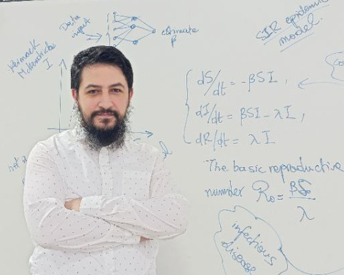



  
  

    <h3>Hamza EL Mahjour</h3>
    
Professor-Researcher

    <ul class="contact-list">
      <li><i class="fas fa-envelope"></i> h.elmahjour@uae.ac.ma</li>
      <li><i class="fas fa-phone"></i>+212 539393743</li>
      <li><i class="fas fa-map-marker-alt"></i> Département SIC : B.P 416 Tanger Principale, Tangier, Morocco</li>
    </ul>
  

  

    <section class="cv-section">
      <h2>Education</h2>
      

        <h3>PhD</h3>
        
 Applied Mathematics, Abdelmalek Essaadi University, Tangier, Morocco.

        
2014 - 2019

      

      

        <h3>Master's Degree</h3>
        
 Scientific Computation and Applications, University of Rennes 1, Rennes, France.

        
2011 - 2013

      

      

        <h3>Bachelor's Degree</h3>
        
 Pure Mathematics, University of Rennes 1, Rennes, France

        
2009 - 2011

      

      

        <h3>Freshman Year at University</h3>
        
 MIPC, FSTT, Tangier, Morocco

        
2008 - 2009

      

      

        <h3>Baccalaureate</h3>
        
Mathematical Sciences (option B), Technical High School of Moulay Youssef, Tangier, Morocco

        
2008

      

    </section>

    <section class="cv-section">
      <h2>Work Experience</h2>
      

        <h3>ENSAT, Abdelmalek Essaadi University</h3>
        
Department of Information Systems and Communications

        
Nov 2024 - Present

        
Lecturer-Researcher

      

      

        <h3>Polidisciplinary Faculty at Larache</h3>
        
Department of Mathematics

        
2020 - Oct 2024

        
Lecturer-Researcher

      

    </section>
    <section class="cv-section">
      <h2>Programming & Modeling</h2>
       

        <h3>Numerical Simulation & Analysis</h3>
        
Matlab, Python (Jupyter Notebooks)

        
Epidemic models, ODE & parameter estimation, optimization on real‐world data

       

       

        <h3>Machine Learning & Neural ODEs</h3>
        
PyTorch (in progress)

        
Neural networks for parameter estimation & ODE solvers

       

       

        <h3>Animation & Visualization</h3>
        
Manim, Inkscape (SVG generation), KdenLive

        
Educational animations, video editing, vector graphics

       

     </section>
  

  

    <section class="cv-section">
      <h2>Research Affiliations</h2>
      

        <h3>MASI Research Team</h3>
        
Mathematics & Intelligent Systems

        
Current Permanent Member

        
ENSAT - UAE

      

      

        <h3>e-COST WIMANET Project</h3>
        
Wildlife Malaria Network

        
European Cooperation in Science and Technology

        
Current Member

      

      

        <h3>LMA Laboratory</h3>
        
Mathematics & Applications Laboratory

        
Current Assistant Member

        
FSTT - UAE

      

      

        <h3> Modélisation et Mathématiques Appliquées Research Team</h3>
        
Mathematics & Applications for Simulation and Mathematical Modeling, Data Analysis and Chemistry of Natural Substances Laboratory

        
Former Permanent Member

        
FPL - UAE

      

    </section>

    <section class="cv-section">
      <h2>Languages</h2>
      

        
Arabic (Native)

        
French (Fluent)

        
English (Fluent)

        
Spanish (Intermediate)

        
Amazigh - Riffian (Basics)

      

    </section>

    <section class="cv-section">
      <h2>Interests</h2>
      

        
Tennis

        
Chess (Best Elo reached : 1806)

        
Reading Novels

        
Historical Documentaries

        
Interfaith Theological Debates

      

    </section>
    <section class="cv-section">
     <h2>Tools & Platforms</h2>
      

        <h3>Document Preparation</h3>
        
LaTeX, Zotero, Obsidian

        
Academic papers, note-taking, reference management

      

      

        <h3>Operating Systems & Hardware</h3>
        
Linux (various distributions), Raspberry Pi

        
System customization, headless server setups

      

      

        <h3>Collaboration & Version Control</h3>
        
Git, Slack, Trello

        
Team workflow organization, code versioning

      

      

        <h3>Community & Outreach</h3>
        
Founder, Children’s Coding Club

        
Workshops in Scratch & basic programming

      

</section>
  

