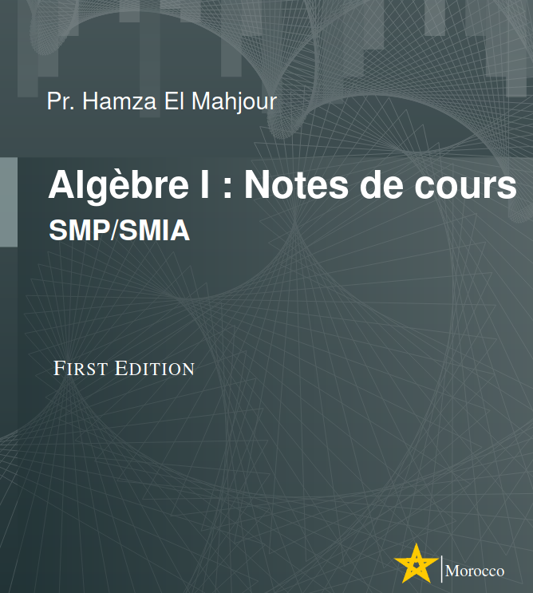

### Ensembles, Structures algébriques, Polynômes ...

| Séquence | Slides | Exercises | Correction |
|------|-------|-----------|------------|
| 1 | [Logique](../../assets/resources/algebra1/parts/part1.pptx) | [TD1](../../assets/resources/algebra1/TD/IA_TD01_ALGEBRE1.pdf) | [Corrigé 1]() |
| 2 | [Ensembles](../../assets/resources/algebra1/parts/part2.pdf) | — | — |
| 3 | [Structures Algébriques](../../assets/resources/algebra1/parts/groupes-anneaux-sq02.pdf) | [TD2](../../assets/resources/algebra1/TD/IA_TD02_ALGEBRE1.pdf) | [Corrigé 2](../../assets/resources/algebra1/TD/IA_TD02_ALGEBRE1.pdf) |
| 4 | [Polynômes I](../../assets/resources/algebra1/parts/polynomes-01.pdf) | [TD3](../../assets/resources/algebra1/TD/IA_TD03_ALGEBRE1.pdf) | [Corrigé 3](../../assets/resources/algebra1/TD/IA_TD03_ALGEBRE1.pdf) |
| 5 | [Polynômes II](../../assets/resources/algebra1/parts/polynomes-02.pdf) | — | — |
| 6 | [Fractions Rationnelles](../../assets/resources/algebra1/parts/fractions_1.pdf) | — | — |

### Archive des Examens et TDs
- [Examen 2025](../../assets/resources/algebra1/exams/EXAM_ALGEBRE1_IA_2425.pdf) | [Rattrapage 2025](../../assets/resources/algebra1/exams/RATTRAPAGE_EXAM_ALGEBRE_IA_20232024.pdf) | [TD01](../../assets/resources/algebra1/TD/IA_TD01_ALGEBRE1_2025.pdf) | [TD02](../../assets/resources/algebra1/TD/old_td/IA_TD02_ALGEBRE1_2025.pdf)| [TD03](../../assets/resources/algebra1/TD/IA_TD03_ALGEBRE1_2025.pdf)|
- [Examen 2024](../../assets/resources/algebra1/exams/archive/EXAM_24_norm.pdf) | [Rattrapage 2024](../../assets/resources/algebra1/exams/archive/RATTRAPAGE_EXAM_ALGEBRE_IA_20232024.pdf) | [TD01](../../assets/resources/algebra1/TD/old_td/IA_TD01_ALGEBRE1_2024.pdf) | [TD02](../../assets/resources/algebra1/TD/old_td/IA_TD02_ALGEBRE1_2024.pdf)| [TD03](../../assets/resources/algebra1/TD/old_td/IA_TD03_ALGEBRE1_2024.pdf)|
- [Examen 2023](../../assets/resources/algebra1/exams/archive/EXAM_ALGEBRE1_SMP_NORMALE_23.pdf) | [Rattrapage 2023](../../assets/resources/algebra1/exams/archive/CC_Algebre_Rattrapage_23.pdf) | [TD01](../../assets/resources/algebra1/TD/old_td/TD01_ALGEBRE01_2223_corrige.pdf) | [TD02](../../assets/resources/algebra1/TD/old_td/TD02_ALGEBRE01_2223_corrige.pdf)| [TD03](../../assets/resources/algebra1/TD/old_td/TD03_ALGEBRE01_2223.pdf)|
- [Examen 2022](../../assets/resources/algebra1/exams/archive/CC_SESSION_NORMALE_SMIA_2022.pdf) | [Rattrapage 2022](../../assets/resources/algebra1/exams/archive/CC_SESSION_RATT_SMIA_2022.pdf) | [TD01](../../assets/resources/algebra1/TD/old_td/SMIA_TD1_ALGEBRE2_corrige_20212022.pdf) | [TD02](../../assets/resources/algebra1/TD/old_td/SMIA_TD02_ALGEBRE2_corrige_20212022.pdf)| [TD03](../../assets/resources/algebra1/TD/old_td/SMIA_TD03_ALGEBRE2_20212022.pdf)|

### Notes de cours

[Télécharger ici](../../assets/resources/algebra1/algebra1.pdf)
