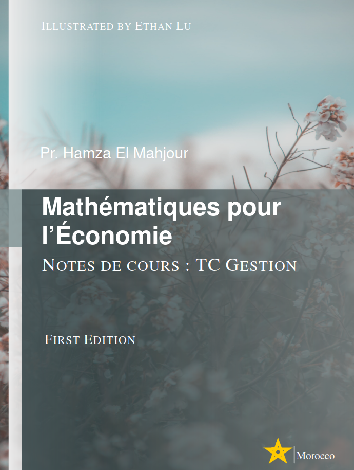

### Fonctions réelles, fonctions à plusieurs variables, calcul matriciel ...

| Séquence | Slides | Exercices | Correction |
|------|-------|-----------|------------|
| 0 | [Ensembles](../../assets/resources/math_eco/parts/calcul_limites.pdf) | [TD1](../../assets/resources/math_eco/TD/TD1.pdf) | [Corrigé 1](../../assets/resources/math_eco/TD/corrige_TD1.pdf) |
| 1 | [Fonctions](../../assets/resources/math_eco/parts/chapitre01-slides.html) | — | — |
| 2 | [Limites:Applications](../../assets/resources/math_eco/parts/calcul_limites.pdf) | — | — |
| 3 | [Intégration 1](../../assets/resources/math_eco/parts/integrales_slides.html) | — | — |
| 4 | [Intégration 2](../../assets/resources/math_eco/parts/integrales_impropres.pdf) | — | — |
| 5 | [Fonctions multivariables](../../assets/resources/math_eco/parts/fonctions_multi.pdf) | — | — |
| 6 | [Optimisation 1](../../assets/resources/math_eco/parts/optimisation_multivariables.pdf) | — | — |
| 7 | [Optimisation 2](../../assets/resources/math_eco/parts/main_function_lagrange.pdf) | — | — |

### Interactive quizes

| Quiz | Link |
|----|----|
| Domaines de définition et intervalles | [Quiz 1](../../assets/resources/math_eco/QUIZ/entainement01.html) |
| Intégrales 1 | [Quiz 2](../../assets/resources/math_eco/QUIZ/quiz_integrale01.html) |
| Intégrales 2 | [Quiz 3](../../assets/resources/math_eco/QUIZ/quiz_integrale02.html) |

### Archive des Examens et TDs
- [Examen 2025](../../assets/resources/math_eco/exams/EXAM_MATHEMATIQUES_SG2024_2025.pdf) | [Rattrapage 2025](../../assets/resources/math_eco/exams/RATT_MATHEMATIQUES_SG2024_2025.pdf) |
- [Examen 2024](../../assets/resources/math_eco/exams/archive/EXAM_MATHEMATIQUES_SG20232024.pdf) | [Rattrapage 2024](../../assets/resources/math_eco/exams/archive/RATTRAPAGE_EXAM_MATHEMATIQUES_SG20232024.pdf) | [TD01](../../assets/resources//TD/old_td/MATHEMATIQUES_SEG_TD01_2324.pdf) | [TD02](../../assets/resources/math_eco/TD/old_td/MATHEMATIQUES_SEG_TD02_2324.pdf)| [TD03](../../assets/resources/math_eco/TD/old_td/MATHEMATIQUES_SEG_TD03_2324.pdf)| [TD04](../../assets/resources/math_eco/TD/old_td/MATHEMATIQUES_SEG_TD04_2324.pdf)|
- [Examen 2023](../../assets/resources/math_eco/exams/archive/examen_2022_2023_corrige.pdf) | [Rattrapage 2023](../../assets/resources/math_eco/exams/archive/CF_AN_SEF_S1_2023_RATTRAPAGE.pdf) | [TD01-cor](../../assets/resources/math_eco/TD/old_td/CORRIGE_TD01_ANALYSE_SEG_2022_2023.pdf) | [TD02-cor](../../assets/resources/math_eco/TD/old_td/TD02_ANALYSE_SEG_2023_CORRECTION.pdf) | 

### Notes de cours

[Télécharger ici](../../assets/resources/math_eco/Mathematics_Economy.pdf)
